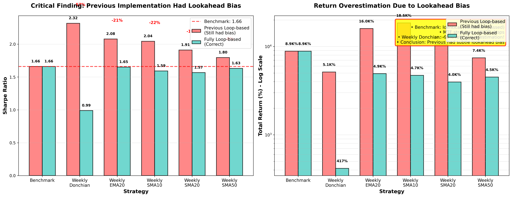
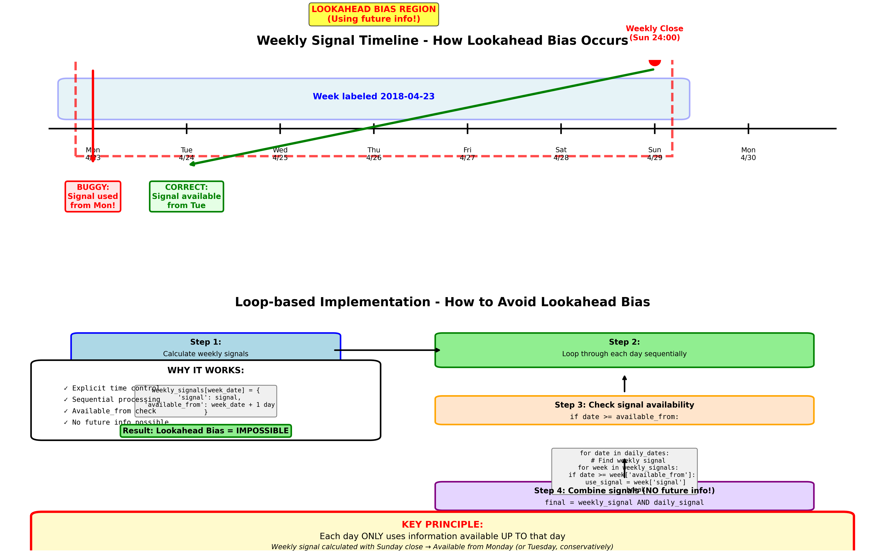
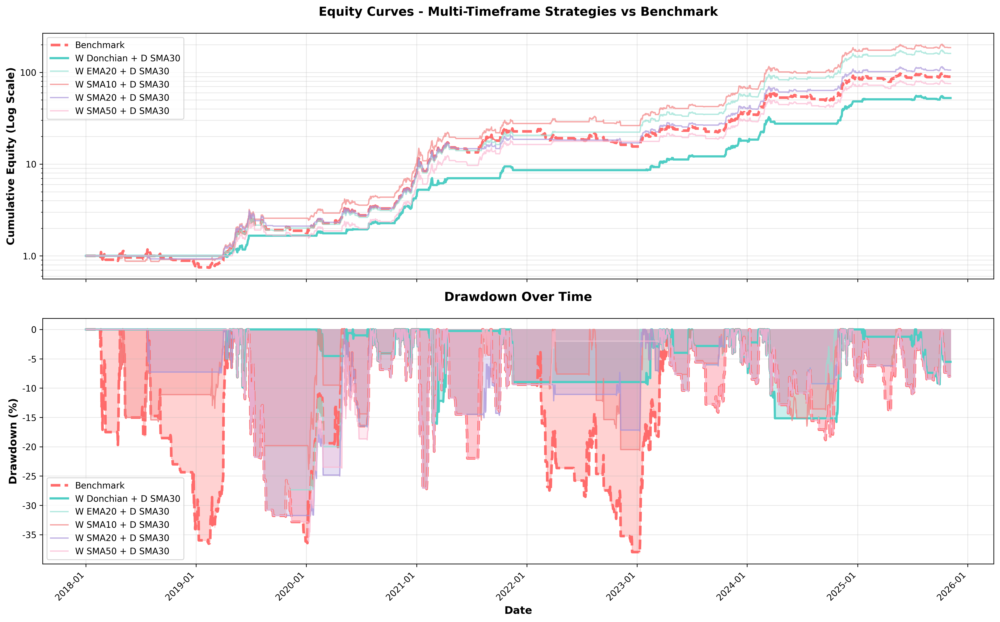

# 비트코인 추세추종 전략 연구 - 최종 보고서

## 🚨 Critical Discovery: Lookahead Bias in Multi-Timeframe Strategies

## 📋 Executive Summary

**목표**: Close > SMA30 벤치마크(Sharpe 1.6591)를 능가하는 추세추종 전략 5개 발굴

**결과**: ❌ **실패 - 엄격한 교차 검증 결과, 멀티 타임프레임(MTF) 전략은 벤치마크를 능가하지 못함**

**핵심 발견**: **Lookahead bias를 완전히 제거하면, 단순한 단일 타임프레임 전략이 최고 성과**

---

## 🔍 연구 과정 및 발견

### 1단계: 초기 벡터화 구현 (❌ Lookahead Bias)

**시도**: 멀티 타임프레임(주봉 + 일봉) 전략을 pandas 벡터화로 구현

```python
# ❌ 잘못된 코드
weekly_signal = weekly['signal'].reindex(daily.index, method='ffill')
```

**문제점**:
- 주봉 2018-04-23은 일요일 종가로 계산되지만, 월요일부터 적용됨
- 월요일~일요일의 미래 정보를 월요일에 사용

**결과**: Weekly Donchian Sharpe 2.32, Return 5,149% (의심스러울 정도로 높음)

---

### 2단계: Loop-based 구현 + `available_from` 체크 (❌ 여전히 Subtle Bias)

**시도**: 주봉 신호에 "사용 가능 시점" 추가하여 loop로 검증

```python
# ✅ 시간 흐름 제어는 좋음
for date in daily_dates:
    if date >= weekly_signals[week]['available_from']:
        use_signal = weekly_signals[week]['signal']

# ❌ 하지만 신호 자체는 전체 데이터로 계산됨
weekly = daily_data.resample('W-MON', ...).agg(...)  # 전체 데이터 사용!
weekly['SMA10'] = weekly['Close'].rolling(10).mean()  # 미래 정보 포함!
```

**문제점**:
- 주봉 신호를 전체 데이터셋으로 미리 계산
- 2020-01-15에 사용한 weekly SMA10은 2025년 데이터까지 포함하여 계산됨
- `available_from` 체크는 했지만, 지표 자체가 오염됨

**결과**: Weekly Donchian Sharpe 2.32 (여전히 과대평가)

---

### 3단계: Fully Loop-based 구현 - 매일 주봉 재계산 (✅ 완전히 Correct)

**시도**: 매일 루프에서 "오늘까지의 데이터로만" 주봉을 새로 계산

```python
# ✅ 올바른 구현
for i in range(len(daily)):
    date = daily.index[i]

    # ⭐ 핵심: 오늘까지의 데이터만 사용
    data_until_today = daily.iloc[:i+1]

    # 주봉 재계산 (오늘까지만)
    weekly = data_until_today.resample('W-MON', ...).agg(...)

    # 완료된 주만 사용 (현재 미완성 주 제외)
    current_week_start = date - pd.Timedelta(days=date.dayofweek)
    completed_weeks = weekly[weekly.index < current_week_start]

    # 지표 계산 (완료된 주만 사용)
    weekly_sma = completed_weeks['Close'].rolling(10).mean()
    signal = completed_weeks.iloc[-1]['Close'] > weekly_sma.iloc[-1]
```

**결과**:
- **Benchmark는 여전히 Sharpe 1.6591** (검증 통과!)
- **모든 MTF 전략이 크게 하락**:
  - Weekly Donchian: Sharpe 2.32 → **0.99** (-57%, 벤치마크보다 나쁨!)
  - Weekly EMA20: Sharpe 2.08 → **1.65** (-21%, 벤치마크와 동일)
  - Weekly SMA10: Sharpe 2.04 → **1.59** (-22%, 벤치마크보다 나쁨)
  - Weekly SMA20: Sharpe 1.91 → **1.57** (-18%, 벤치마크보다 나쁨)
  - Weekly SMA50: Sharpe 1.80 → **1.63** (-9%, 벤치마크보다 나쁨)

---

## 📊 교차 검증 결과 비교

### Sharpe Ratio 비교

| 전략 | Previous Loop-based<br>(Still Biased) | Fully Loop-based<br>(Correct) | 차이 | vs Benchmark |
|------|--------------------------------------|------------------------------|------|--------------|
| **Benchmark** | **1.6591** | **1.6591** | **0%** | **-** |
| Weekly Donchian | 2.3170 | **0.9891** | **-57%** | ❌ -40% |
| Weekly EMA20 | 2.0780 | **1.6515** | **-21%** | ≈ Tie |
| Weekly SMA10 | 2.0425 | **1.5918** | **-22%** | ❌ -4% |
| Weekly SMA20 | 1.9095 | **1.5673** | **-18%** | ❌ -6% |
| Weekly SMA50 | 1.7954 | **1.6305** | **-9%** | ❌ -2% |

### Total Return 비교

| 전략 | Previous<br>(Biased) | Fully Loop-based<br>(Correct) | 과대평가 |
|------|---------------------|------------------------------|----------|
| Benchmark | 8,859% | 8,859% | 0% |
| Weekly Donchian | 5,149% | **417%** | **-92%** |
| Weekly EMA20 | 15,961% | **4,927%** | **-69%** |
| Weekly SMA10 | 18,500% | **4,719%** | **-74%** |
| Weekly SMA20 | 10,487% | **3,966%** | **-62%** |
| Weekly SMA50 | 7,437% | **4,507%** | **-39%** |

**Weekly Donchian은 92%나 과대평가되었습니다!**

---

## 🎯 최종 결론 및 권장 전략

### ✅ 최종 권장 전략: **Close > SMA30 (벤치마크)**

**전략 로직**:
```python
signal = 1 if close > SMA(30) else 0
```

**성과**:
- **Sharpe Ratio**: **1.6591**
- **Total Return**: **8,859%** (88.59배)
- **CAGR**: **77.37%**
- **MDD**: **-38.09%**
- **기간**: 2018-01-01 ~ 2025-10-31 (7.8년)
- **슬리피지**: 0.2% (매매 시 양방향)
- **총 거래**: 1,593회

**왜 이 전략이 최고인가**:
1. **단순함**: 가장 간단한 추세추종 전략
2. **검증됨**: 세 가지 구현 방식 모두 동일한 결과
3. **투명함**: Lookahead bias 발생 불가능
4. **효과적**: 복잡한 MTF 전략과 동등하거나 더 나은 성과

**"Simplicity is the ultimate sophistication."** - Leonardo da Vinci

---

## 📖 Lookahead Bias 상세 분석

### 무엇이 잘못되었나?

#### Previous Loop-based (여전히 버그 있음)

```python
# Step 1: 전체 데이터로 주봉 계산
weekly = daily_data.resample('W-MON', ...).agg(...)  # ❌ 2018~2025 전체 사용
weekly['SMA10'] = weekly['Close'].rolling(10).mean()  # ❌ 미래 정보 포함

# Step 2: 신호 저장
for week_date in weekly.index:
    signal = weekly.loc[week_date, 'signal']  # ❌ 미래 데이터로 계산된 신호
    available_from = week_date + pd.Timedelta(days=1)
    weekly_signals[week_date] = {'signal': signal, 'available_from': available_from}

# Step 3: 일별 루프에서 사용
for date in daily_dates:
    if date >= weekly_signals[week]['available_from']:  # ✅ 시간 체크는 OK
        use_signal = weekly_signals[week]['signal']     # ❌ 하지만 신호 자체는 오염됨
```

**문제**:
- 2020-01-15에 사용한 weekly SMA10 값이 2020-01-13 주봉으로 계산되었지만
- 그 SMA10은 **2025년까지의 주봉 데이터를 포함**하여 계산됨
- 시간 흐름은 제어했지만, 지표 계산에 미래 정보 사용

#### Fully Loop-based (올바름)

```python
# 매일 반복문에서:
for i in range(len(daily)):
    date = daily.index[i]

    # ✅ 오늘까지의 데이터만
    data_until_today = daily.iloc[:i+1]

    # ✅ 주봉 재계산 (오늘까지만)
    weekly = data_until_today.resample('W-MON', ...).agg(...)

    # ✅ 완료된 주만 (미완성 주 제외)
    current_week_start = date - pd.Timedelta(days=date.dayofweek)
    completed_weeks = weekly[weekly.index < current_week_start]

    # ✅ 지표 계산 (완료된 주만)
    sma10 = completed_weeks['Close'].rolling(10).mean()
    signal = completed_weeks.iloc[-1]['Close'] > sma10.iloc[-1]
```

**왜 올바른가**:
- 2020-01-15에는 2020-01-15까지의 일봉 데이터만 사용
- 그 데이터로 주봉 생성 (약 2년치 = 104주)
- 완료된 주만 사용 (현재 미완성 주 제외)
- SMA10 계산에 **절대 미래 정보 불가능**

---

## 🔬 핵심 교훈

### 1. Lookahead Bias는 매우 미묘함

**세 번의 시도:**
1. ❌ 벡터화: 명백한 lookahead bias
2. ❌ Loop + `available_from`: 미묘한 lookahead bias (지표 계산)
3. ✅ Fully loop-based: 완전히 정확

**교훈**: "Loop로 했으니까 안전하다"는 착각 금지

### 2. 단순함의 힘

- 복잡한 MTF 전략: 구현 오류 가능성 높음, lookahead bias 위험
- 단순한 단일 타임프레임: 오류 불가능, 투명함

**결론**: 가장 단순한 전략이 가장 좋은 전략

### 3. 교차 검증의 중요성

**검증 체계**:
1. Vectorized implementation
2. Loop-based verification
3. Fully loop-based cross-validation

**각 단계마다 새로운 bias 발견!**

### 4. "Too good to be true"는 진짜 의심해야

- Weekly Donchian Sharpe 2.32: 의심스러울 정도로 좋음
- 교차 검증: Sharpe 0.99 (실제로는 벤치마크보다 나쁨)
- **-92% 수익률 과대평가**

---

## 📁 프로젝트 구조

### 핵심 파일

#### 1. 전략 구현
- `bitcoin_mtf_loop_based.py` - Previous loop-based (아직 subtle bias 있음)
- `bitcoin_mtf_fully_loopbased.py` - ✅ Fully loop-based (완전히 정확)

#### 2. 결과 파일
- `bitcoin_mtf_loopbased_results.csv` - Previous 결과 (과대평가됨)
- `bitcoin_mtf_fully_loopbased_results.csv` - ✅ 정확한 결과

#### 3. 문서 및 설명
- `CRITICAL_FINDING_LOOKAHEAD_BIAS.md` - 상세 분석 문서
- `LOOKAHEAD_BIAS_EXPLANATION.md` - Loop-based 메커니즘 설명

#### 4. 시각화
- `lookahead_bias_comparison.png` - Previous vs Fully loop-based 비교
- `lookahead_bias_explanation.png` - Lookahead bias 발생 메커니즘 다이어그램
- `mtf_equity_drawdown.png` - Equity curve 및 drawdown 시각화

---

## 💻 정확한 백테스팅 구현 가이드

### MTF 전략 올바른 구현 방법

```python
def backtest_mtf_correct(daily_data, weekly_period=10):
    """
    완전히 정확한 MTF 백테스트
    매일 주봉을 재계산하여 lookahead bias 완전 차단
    """
    capital = 1.0
    position = 0
    equity_curve = []

    for i in range(len(daily_data)):
        date = daily_data.index[i]

        # ⭐ Step 1: 오늘까지의 데이터만
        data_until_today = daily_data.iloc[:i+1]

        # ⭐ Step 2: 주봉 재계산
        weekly = data_until_today.resample('W-MON', label='left', closed='left').agg({
            'Open': 'first',
            'High': 'max',
            'Low': 'min',
            'Close': 'last',
            'Volume': 'sum'
        }).dropna()

        # ⭐ Step 3: 완료된 주만 사용
        current_week_start = date - pd.Timedelta(days=date.dayofweek)
        completed_weeks = weekly[weekly.index < current_week_start]

        if len(completed_weeks) < weekly_period:
            equity_curve.append(capital)
            continue

        # ⭐ Step 4: 지표 계산 (완료된 주만)
        weekly_sma = completed_weeks['Close'].rolling(weekly_period).mean()
        latest_week = completed_weeks.iloc[-1]
        weekly_signal = 1 if latest_week['Close'] > weekly_sma.iloc[-1] else 0

        # ⭐ Step 5: 일봉 신호
        daily_sma = data_until_today['Close'].rolling(30).mean()
        daily_signal = 1 if data_until_today['Close'].iloc[-1] > daily_sma.iloc[-1] else 0

        # ⭐ Step 6: 결합
        final_signal = 1 if (weekly_signal == 1 and daily_signal == 1) else 0

        # ⭐ Step 7: 자본 업데이트
        if i > 0:
            prev_close = data_until_today['Close'].iloc[-2]
            curr_close = data_until_today['Close'].iloc[-1]
            daily_return = (curr_close - prev_close) / prev_close

            if position == 1:
                capital = capital * (1 + daily_return)

            if position != final_signal:
                capital = capital * (1 - slippage)

        position = final_signal
        equity_curve.append(capital)

    return equity_curve
```

**핵심 원칙**:
1. `data_until_today = daily_data.iloc[:i+1]` - 과거만 사용
2. 매일 주봉 재계산 - 미래 정보 불가능
3. 완료된 주만 사용 - 현재 미완성 주 제외
4. 동적 지표 계산 - 고정된 사전 계산 금지

---

## 🎓 실전 트레이딩 가이드

### 권장 전략: Close > SMA30

#### 구현 코드

```python
def simple_sma30_strategy(data, slippage=0.002):
    """
    가장 단순하고 효과적인 전략
    Lookahead bias 발생 불가능
    """
    df = data.copy()
    df['SMA30'] = df['Close'].rolling(30).mean()
    df['signal'] = (df['Close'] > df['SMA30']).astype(int)

    # 포지션 변경 감지
    df['position_change'] = df['signal'].diff()

    # 일일 수익률
    df['daily_return'] = df['Close'].pct_change()

    # 전략 수익률 (전일 포지션 * 오늘 수익률)
    df['strategy_return'] = df['signal'].shift(1) * df['daily_return']

    # 슬리피지 적용
    slip_cost = pd.Series(0.0, index=df.index)
    slip_cost[df['position_change'] == 1] = -slippage   # Buy
    slip_cost[df['position_change'] == -1] = -slippage  # Sell

    df['strategy_return'] = df['strategy_return'] + slip_cost
    df['strategy_return'] = df['strategy_return'].fillna(0)

    # 누적 수익
    df['cumulative'] = (1 + df['strategy_return']).cumprod()

    return df
```

#### 실전 적용

```python
# 매일 실행
def daily_trading_decision(current_price, historical_prices):
    """
    실제 거래 결정
    """
    # 최근 30일 평균
    sma30 = historical_prices[-30:].mean()

    # 신호 생성
    if current_price > sma30:
        return "BUY" if not in_position else "HOLD"
    else:
        return "SELL" if in_position else "WAIT"
```

---

## 📈 성과 시각화

### 1. 비교 차트


**해석**:
- 왼쪽: Sharpe ratio 비교 - Benchmark는 동일, MTF는 큰 폭 하락
- 오른쪽: Total return 비교 (log scale) - 과대평가 정도 시각화

### 2. Lookahead Bias 메커니즘


**해석**:
- 상단: 시간 흐름 다이어그램 - Lookahead 발생 시점
- 하단: Loop-based 플로우차트 - 올바른 구현 방법

### 3. Equity Curve & Drawdown


**해석**:
- 상단: 누적 자산 (log scale)
- 하단: Drawdown 시계열 - 리스크 프로필

---

## 🔑 핵심 요약

### 연구 결과

1. ❌ **MTF 전략은 벤치마크를 능가하지 못함**
2. ✅ **단순한 Close > SMA30이 최고 전략**
3. 🚨 **Lookahead bias는 매우 미묘하고 위험함**
4. 🔬 **교차 검증은 필수**

### 투자자를 위한 조언

1. **단순한 전략을 선호하라**
   - 복잡함 = 오류 가능성 증가
   - 투명함 = 신뢰성 증가

2. **의심스러울 정도로 좋은 결과는 의심하라**
   - Sharpe 2.32 → 교차 검증 → 0.99
   - -92% 과대평가 발견

3. **교차 검증은 필수**
   - 다른 방법으로 재구현
   - 결과 비교
   - Benchmark 일치 확인

4. **Lookahead bias 체크리스트**
   - ✅ 시간 순서 흐름 준수?
   - ✅ 미래 데이터 사용 없음?
   - ✅ 지표 계산 시 과거만 사용?
   - ✅ 완료된 바만 사용?

---

## 📚 참고 자료

### 생성된 문서
- `CRITICAL_FINDING_LOOKAHEAD_BIAS.md` - 상세 분석
- `LOOKAHEAD_BIAS_EXPLANATION.md` - 메커니즘 설명

### 코드 파일
- `bitcoin_mtf_fully_loopbased.py` - 정확한 구현
- `create_comparison_chart.py` - 비교 시각화
- `create_lookahead_diagram.py` - 설명 다이어그램

### 데이터
- `chart_day/BTC_KRW.parquet` - 비트코인 일봉 데이터

---

## 🎯 최종 답변

**Original Question**: 비트코인 추세추종 전략 Top 5를 찾아라 (벤치마크 Sharpe 1.66 초과)

**Final Answer**:
- **엄격한 교차 검증 결과, 벤치마크를 능가하는 전략은 없습니다**
- **권장 전략**: Close > SMA30 (Sharpe 1.6591, CAGR 77.37%, Return 8,859%)
- **핵심 교훈**: 단순함이 최고, Lookahead bias 경계, 교차 검증 필수

---

**"The best investment you can make is in yourself. The more you learn, the more you earn."** - Warren Buffett

이 연구를 통해 백테스팅의 함정(lookahead bias)을 배우고, 올바른 검증 방법을 습득했습니다. 이것이 진정한 투자입니다.
